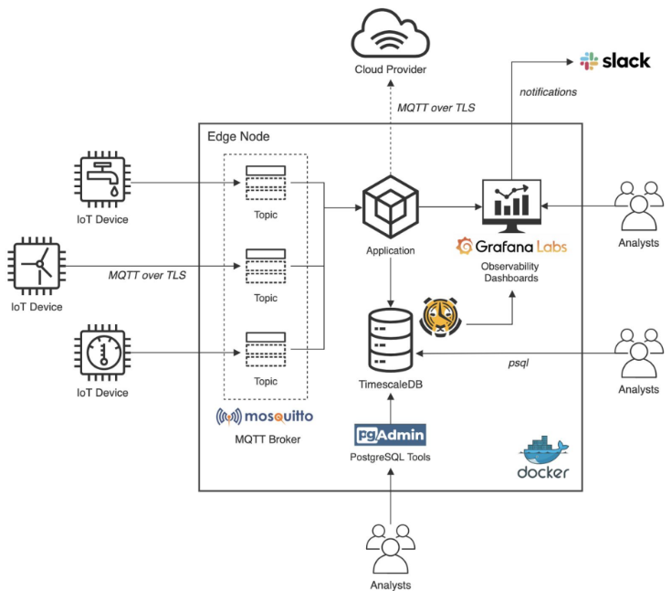

# Ejercicio CiberKillChain - Ataque

 * Alumna: Josselyn Ordóñez

## Sistema Víctima
Debido a que no se tiene aún un trabajo práctico definido, se hará el ataque en base al trabajo práctico de la materia de Desarrollo de Aplicaciones IoT.

### Capa de Percepción

Mediante la utilización de un microcontrolador ESP32 y un sensor DHT11, se implementa:

- Nodo conectado vía Wi-Fi.
- Reportes de mediciones de la variable a medir cada 30 seg.
- Comunicación entre el nodo sensor y el servidor mediante TLS.
- Implementación de canales de actuación remota.

### Capa de Transporte
Se utiliza el protocolo MQTT con capa de seguridad TLS

### Capa de Procesamiento, Persistencia y Visualización

#### A. Base de Datos

1. Se utiliza Postgres SQL

#### B. API - NodeJs + Express

1. Persistencia de telemetrías enviadas por el nodo sensor.
2. Persistencia de los atributos de los nodos sensores registrados.
3. Recuperación de datos o atributos de un nodo sensor determinado.

#### C. Visualización (Interfaz de Usuario)

1. Visualización del ID del nodo y último valor reportado.
2. Timestamp de la última telemetría almacenada.
3. Visualización del estado de los canales de actuación remota.
4. Visualización del estado del nodo sensor.
5. Gráfica de serie temporal de temperatura y humedad.

## Enunciado

Armar una cyberkillchain usando técnicas de la matriz de Att&ck para un escenario relacionado al trabajo práctico de la carrera.

### Objetivo del ataque

El atacante pertenece a una banda de ladrones de casas moderanas. Sabe que algunas casas, como la de la víctima, tienen sistemas IoT que miden la temperatura del ambiente y se aprovecha de estos sistemas para deducir cuándo hay personas en la casa y cuándo no. Su estrategia es atacar estos sistemas y traer la información de la temperatura en las épocas de invierno. Si la temperatura es reducida, significa que la calefacción no está encendida y hay grandes posibilidades de que no haya nadie en casa. Una vez encuentra una casa vacía, es buen momento para entrar a saquear.

Por tanto, el objetivo del ciberataque es infiltrarse en el sistema y tener la información de las mediciones de temperatura en tiempo real.

### Diseño del ciberataque

* Reconnaissance
  - Busco a la victima en Linkedin y noto que es alumna de la especialidad de CEIoT en la UBA. Además, tiene un enlace a su Github.
  - Reviso los repositorios en Github y veo un repositorio público de un sistema IoT de Temperatura y humedad.
  - Analizo el código para identificar vulnerabilidades y veo que el sistema usa certificadosautofirmados. Además, se usa un ESP32 con acceso a wifi.
  - Averiguo el IP del domicilio a atacar.

* Weaponization
  - **Puedo** Convencer a los residentes de que proporcionen la contraseña de Wi-Fi con ingeniería social.
  - **Decido** crear un punto de acceso Wi-Fi falso con un nombre similar al de la red legítima (Evil Twin) y engañar a los usuarios para que se conecten a él.
  
* Delivery
  - Instalo el punto de acceso falso.
  
* Exploit
  - Capturo la contraseña del Wifi e intercepto las comunicaciones entre el cliente y servidor para obtener el certificado.
  
* Installation  
  - Creo un nuevo certificado utilizando la misma información que el certificado legítimo (por ejemplo, el nombre del servidor, el nombre de la organización, etc.).
  - Realizo un ataque man-in-the-niddle (MITM), interceptando la conexión TLS y presentando el certificado autofirmado falso.

* Command & Control
  - **Decido** suscribirme a la información de telemetría de temperatura.
  
* Actions on Objectives
  - La banda de ladrones usa la información de temperatura para robar la cada cuando no hay nadie presente.

  

