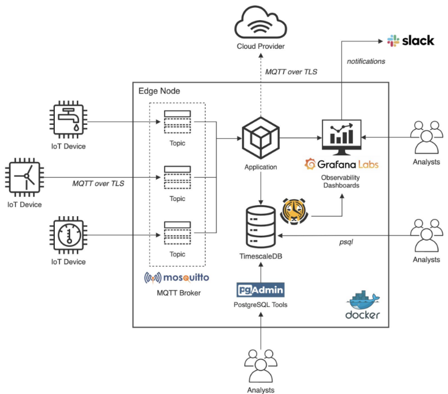

# Ejercicio CiberKillChain - Ataque

Crear un nuevo documento en esta carpeta con las siguientes secciones:

 * Alumna: Josselyn Ordóñez

## Descripción del trabajo práctico
Debido a que no se tiene aún un trabajo práctico definido, se hará el ataque en base al trabajo práctico de la materia de Desarrollo de Aplicaciones IoT.

### Capa de Percepción

Mediante la utilización de un microcontrolador ESP32 y un sensor, se implementa:

- Nodo se conectado vía Wi-Fi.
- Reportes de mediciones de la variable a medir cada 30 seg.
- Comunicación entre el nodo sensor y el servidor mediante TLS.
- Implementación de canales de actuación remota.

### Capa de Transporte
Se pide utilizar protocolo MQTT con capa de seguridad TLS

### Capa de Procesamiento, Persistencia y Visualización

#### A. Base de Datos

1. Podrá utilizarse tanto SQL como NO-SQL.

#### B. API - NodeJs + Express

1. Persistencia de telemetrías enviadas por el nodo sensor.
2. Persistencia de los atributos de los nodos sensores registrados.
3. Recuperación de datos o atributos de un nodo sensor determinado.

#### C. Visualización (Interfaz de Usuario) - DAW/DAM o propio

1. Visualización del ID del nodo y último valor reportado.
2. Timestamp de la última telemetría almacenada.
3. Visualización del estado de los canales de actuación remota (opcional).
4. Visualización del estado del nodo sensor (opcional si se implementa e).
5. Gráfica de serie temporal de temperatura y humedad (opcional - recomendado).

## Enunciado

Armar una cyberkillchain usando técnicas de la matriz de Att&ck para un escenario relacionado al trabajo práctico de la carrera.

### Instrucciones

Debe haber un objetivo para el ataque, algunas ideas inspiradoras:

* Obtener información con algún tipo de valor.
* Alguna variante extorsiva de ransomware.
* Usar de plataforma para atacar a otros, ya sea por ancho de banda, anonimización o como desplazamiento lateral hacia un objetivo más interesante.
* Usar la plataforma para extraerle valor como criptominado o almacenamiento de información ilegal.
* Sabotear la plataforma a favor de la competencia, tipo stuxnet.

El escenario debe asumir el sistema ya funcionando en el futuro.

Debe ser en primera persona, es el punto de vista del atacante.

Es recomendable hacer dos o tres pasadas, en la primera la idea, en las siguientes refinamientos especificando las técnicas.
PURO ATAQUE, nada de andar pensando cómo corregir nada.

Para cada etapa, si hay varias medidas posibles, ordenar dejando para lo último lo que se va a hacer en el siguiente paso.

### Ejemplo adaptado a un juego de guerra inventado

Objetivo del ataque: inhabilitar sin destruir el puerto enemigo con vistas a posteriormente tomarlo.

* Reconnaissance
  - Imagen satelital identifica una pista de aterrizaje.
  - Espías dicen que por el puerto entra el combustible.
  - Espías locales dicen que la playa cercana no tiene buena vigilancia.

* Weaponization
  - **Puedo** preparar un bombardeo.
  - **Decido** preparar un equipo de comandos de sabotage.
  
* Delivery
  - Envío al equipo de sabotage a la playa cercana en submarino.
  
* Exploit
  - El equipo logra desembarcar sin incidentes en la playa.
  
* Installation  
  - El equipo se hace pasar por una compañia de circo como camuflaje.

* Command & Control
  - **Puedo** utilizar palomas mensajeras.
  - **Decido** utilizar Super High TeraHertz Radio que el adversario no puede detectar.
  
* Actions on Objectives
  - El equipo de comandos provoca daños menores en las cañerías.
  - El equipo de comandos coloca minas en el puerto dejando un camino para el desembarco.
  
### Ejemplo stuxnet

Deducido a partir de https://attack.mitre.org/software/S0603/

Objetivo del ataque: dañar las centrifugadoras de uranio

* Reconnaissance
  - TBD
  - TBD
  - TBD

* Weaponization
  - Se arma una pieza de malware utilizando zero days, información del fabricante de los sistemas SCADA y PLC
  
* Delivery
  - T1091 	Replication Through Removable Media https://attack.mitre.org/techniques/T1091
* Exploit
  - T1091 	Replication Through Removable Media https://attack.mitre.org/techniques/T1091
  
* Installation  
  - TBD

* Command & Control
  - TBD
  
* Actions on Objectives

  - T0831 	Manipulation of Control https://attack.mitre.org/techniques/T0831

  

